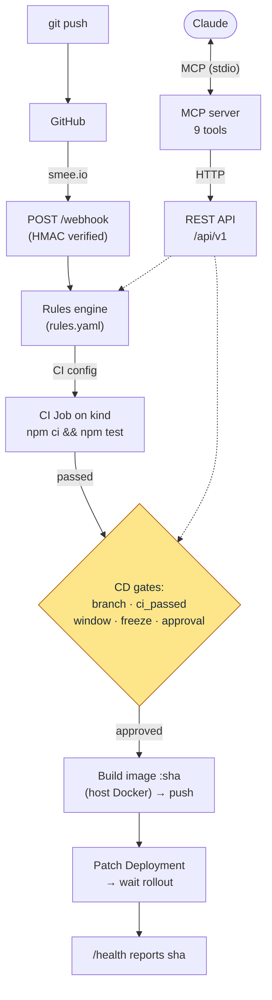

# Helmsman

Push code → CI runs in Kubernetes → CD deploys (or blocks) → manage it all by talking to Claude.

A mini CI/CD **pipeline control plane** you can drive over HTTP or by talking to
Claude. You configure rules for when CI runs and when CD deploys; Helmsman runs
CI as Kubernetes Jobs on a local [kind](https://kind.sigs.k8s.io/) cluster,
deploys a dummy app, enforces deploy windows / freezes / approvals, and exposes
an **MCP server** so the whole pipeline is operable from Claude.



## Features

- **Rules engine** — YAML-configured CI triggers (events, path globs, skip
  markers) and CD gates (branch, `ci_passed`, time windows, freezes, approval),
  all evaluated in a single timezone (UTC stored, IST evaluated).
- **CI runner** — one-shot Kubernetes Jobs (`node:20`) that clone the commit and
  run `npm ci && npm test`; polled to completion with a hard deadline;
  reconciled on boot.
- **CD deployer** — builds the image on the host (tagged with the commit SHA),
  pushes to the local registry, patches the Deployment, waits for rollout, and
  supports rollback to the previous live commit.
- **Durable history** — every run and freeze is stored in SQLite.
- **GitHub webhook** — HMAC-verified `push` events, forwarded to localhost via
  smee.io.
- **MCP server** — a stdio server exposing the pipeline to Claude as 9 tools.

## Tech stack

NestJS · TypeScript · `@kubernetes/client-node` · `better-sqlite3` ·
`@modelcontextprotocol/sdk` · zod · dayjs · Docker · kind · Vitest

## Repository layout

```
src/
├── main.ts                 # bootstrap: /api/v1 prefix, ValidationPipe, rawBody
├── app.module.ts
├── rules/     # rules engine (pure) + RulesService      — parse rules.yaml, evaluate CI/CD
├── store/     # Store interface + MemoryStore + SqliteStore
├── runner/    # CI runner (pure) + RunnerService + K8s Job client
├── deployer/  # CD deployer (pure) + host-docker builder + K8s Deployment client
├── trigger/   # TriggerController + PipelineService (CI → on pass → CD)
├── freeze/    # dynamic freeze CRUD
├── insights/  # metrics + explain
├── webhook/   # GitHub webhook (HMAC + push → PipelineEvent)
├── mcp/       # MCP server (stdio) + thin HTTP api-client
└── cli/       # trigger-ci.ts (manual CI without the HTTP server)
k8s/           # dummy-app Deployment/Service, RBAC, CI Job template
rules.yaml     # pipeline configuration
```

Pure logic (`rules`, `runner`, `deployer`, `store` algorithms) is framework-free
so the MCP server and tests can reuse it without booting NestJS.

## Prerequisites

- Node.js 20+
- Docker
- A kind cluster with a local registry at `localhost:5001`
- `kubectl` pointed at that cluster
- The app being deployed: [`Dummy-app`](https://github.com/Junaid1cr/Dummy-app)
  (a small Express app with `/health` and `/`)

## Setup

### 1. Deploy the dummy app

```bash
# from the Dummy-app checkout
docker build --build-arg APP_VERSION=bootstrap -t localhost:5001/dummy-app:bootstrap .
docker push localhost:5001/dummy-app:bootstrap
kubectl apply -f k8s/dummy-app.yaml   # from this repo
kubectl rollout status deployment/dummy-app
```

> **If pods hit `ImagePullBackOff` from `localhost:5001`**, the kind node's
> containerd isn't wired to the registry. On containerd v2 (config `version = 2`):
> ```bash
> docker network connect kind kind-registry 2>/dev/null || true
> NODE=$(docker ps --filter label=io.x-k8s.kind.cluster --format '{{.Names}}' | head -1)
> docker exec "$NODE" mkdir -p /etc/containerd/certs.d/localhost:5001
> docker exec "$NODE" bash -c 'echo "[host.\"http://kind-registry:5000\"]" > /etc/containerd/certs.d/localhost:5001/hosts.toml'
> docker exec "$NODE" bash -c 'grep -q config_path /etc/containerd/config.toml || printf "\n[plugins.\"io.containerd.grpc.v1.cri\".registry]\n  config_path = \"/etc/containerd/certs.d\"\n" >> /etc/containerd/config.toml'
> docker exec "$NODE" systemctl restart containerd
> ```

### 2. Install and run the control plane

```bash
npm install
npm run start:dev          # http://localhost:4000/api/v1
```

### 3. Configure rules

Edit [`rules.yaml`](./rules.yaml):

```yaml
ci:
  on: [push, pull_request]        # events CI runs on
  paths: ["src/**", "Dockerfile"] # only run if a changed file matches
  skip_if_commit_contains: "[skip ci]"
cd:
  branches: [main]                # deployable branches
  require: ci_passed              # gate on CI
  windows: "Mon-Thu 10:00-17:00 IST"  # deploy window (optional)
  freeze: ["2026-10-20..2026-10-23"]  # static freezes (optional)
  approval: manual                # "manual" | "auto"
```

Changes are hot-reloaded (watched by mtime).

## REST API (`/api/v1`)

| Method & path | Purpose |
|---|---|
| `POST /trigger` | Run the pipeline for an event `{repo, branch, commit, message, changedFiles, eventType}` → `202` + run id |
| `GET /runs` | List runs (`?kind=ci\|cd&status=&branch=&limit=`) |
| `GET /runs/:id` | One run, with logs |
| `POST /deploy` | Manually deploy `{commit, repo?, branch?, message?}` (respects gates) |
| `POST /deploy/:id/approve` | Approve an `awaiting_approval` deploy |
| `POST /rollback` | Roll back to the previous live commit |
| `GET /freeze` · `POST /freeze` · `DELETE /freeze/:id` | Manage dynamic freezes |
| `GET /metrics` | CI success rate/duration, deploy & rollback counts, frequency |
| `GET /explain?commit=` | Why a commit did/didn't run CI or deploy |
| `POST /webhook` | GitHub webhook (HMAC-verified) |

Run states: **CI** `queued · running · passed · failed · timed_out · skipped` ·
**CD** `queued · awaiting_approval · deploying · deployed · rolled_back · blocked · failed`.

## MCP server

A separate stdio process that is a thin HTTP client of the REST API (no pipeline
logic of its own). The control plane must be running.

```bash
npm run mcp     # or register via .mcp.json (included) in your MCP client
```

`.mcp.json` registers it for Claude Code. Tools: `list_runs`, `get_run`,
`explain_skip`, `get_metrics`, `trigger_deploy`, `approve_deploy`, `rollback`,
`set_freeze`, `remove_freeze`. Then ask Claude things like *"list recent runs"*,
*"deploy commit abc123"*, *"freeze deploys Oct 20–23"*, *"roll back"*.

## GitHub webhook (smee.io)

```bash
# 1. start a channel at https://smee.io and forward it to localhost
npx smee-client --url https://smee.io/<channel> --target http://localhost:4000/api/v1/webhook

# 2. add a webhook in the Dummy-app repo:
#    Payload URL = the smee URL, Content type = application/json,
#    Secret = <your secret>, Events = push

# 3. run the control plane with the matching secret
GITHUB_WEBHOOK_SECRET=<your secret> npm run start:dev
```

A `git push` under `src/**` then drives the pipeline end to end.

## Configuration (environment variables)

| Var | Default | Used by |
|---|---|---|
| `PORT` | `4000` | HTTP server |
| `HELMSMAN_DB` | `data/helmsman.sqlite` | store |
| `RULES_PATH` | `./rules.yaml` | rules engine |
| `HELMSMAN_NAMESPACE` | `default` | CI / CD |
| `CI_MAX_DURATION_SEC` | `600` | CI job deadline |
| `HELMSMAN_REGISTRY` / `HELMSMAN_IMAGE` | `localhost:5001` / `dummy-app` | image build |
| `HELMSMAN_DEPLOYMENT` / `HELMSMAN_CONTAINER` | `dummy-app` / `dummy-app` | CD |
| `CD_ROLLOUT_TIMEOUT_MS` | `120000` | CD rollout wait |
| `HELMSMAN_APP_REPO` | Dummy-app URL | manual deploy default repo |
| `GITHUB_WEBHOOK_SECRET` | *(unset → verification disabled)* | webhook |
| `HELMSMAN_API_URL` | `http://localhost:4000/api/v1` | MCP server |

## Testing

```bash
npm test        # Vitest — pure logic (rules, runner, deployer, store, insights, webhook, mcp client)
npm run build   # tsc
```

## Notes & limitations

- The control plane runs on the host and uses your kubeconfig and Docker; it is a
  local learning tool, not production-hardened.
- `require: ci_passed` is checked against recorded run history for the commit.
- CD builds images on the host (Docker). Swapping in an in-cluster
  [kaniko](https://github.com/GoogleContainerTools/kaniko) build and
  containerizing the control plane (see `k8s/pipeline-rbac.yaml`) are natural
  next steps.
